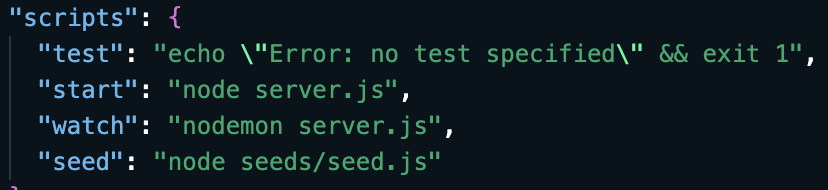
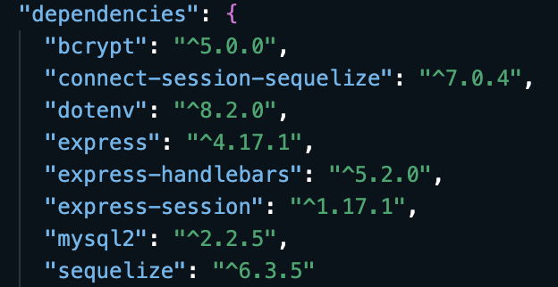
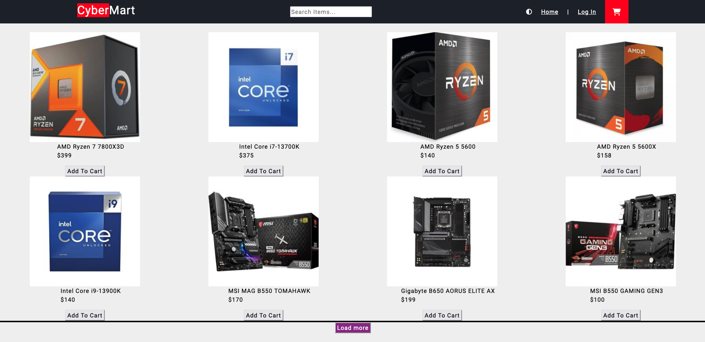

For more information on MIT visit https://opensource.org/licenses/MIT
# <CyberMart>

## Description

Our motivation to create this web application stemmed from the expanding technology market and the recent emergence of various new technologies, leading us to build a clean, well-designed, and user-friendly website that simplifies technology access for customers, specifically addressing the problem of assisting everyday people in building a PC, while also providing me with valuable experience in building an e-commerce website.

## Table of Contents

- [Installation](#installation)
- [Usage](#usage)
- [Credits](#credits)
- [License](#license)

## Installation

To get started with our project, follow these steps:

1. Open up the terminal.
2. Run the following command to install dependencies: (npm i)
3. Set up your MySQL database:
4. Seed the database: (npm run seed)
5. Start the application: (npm start)

## Usage

To use the website:

1. Search for the computer parts you want.
2. Add them to your cart.
3. Proceed to checkout.

## Credits

Thanks to our collaborators for their contributions:

- [Daniel Z](https://github.com/Ch40s1)
- [Crislyn W](https://github.com/c-wrenn)
- [Chaye W](https://github.com/starshipog)

### <a href="https://cybermart1-76e7c43ac326.herokuapp.com/">Website Link</a>

## License

MIT License

Copyright (c) 2023 Daniel A Zarate

Permission is hereby granted, free of charge, to any person obtaining a copy
of this software and associated documentation files (the "Software"), to deal
in the Software without restriction, including without limitation the rights
to use, copy, modify, merge, publish, distribute, sublicense, and/or sell
copies of the Software, and to permit persons to whom the Software is
furnished to do so, subject to the following conditions:

The above copyright notice and this permission notice shall be included in all
copies or substantial portions of the Software.

THE SOFTWARE IS PROVIDED "AS IS", WITHOUT WARRANTY OF ANY KIND, EXPRESS OR
IMPLIED, INCLUDING BUT NOT LIMITED TO THE WARRANTIES OF MERCHANTABILITY,
FITNESS FOR A PARTICULAR PURPOSE AND NONINFRINGEMENT. IN NO EVENT SHALL THE
AUTHORS OR COPYRIGHT HOLDERS BE LIABLE FOR ANY CLAIM, DAMAGES OR OTHER
LIABILITY, WHETHER IN AN ACTION OF CONTRACT, TORT OR OTHERWISE, ARISING FROM,
OUT OF OR IN CONNECTION WITH THE SOFTWARE OR THE USE OR OTHER DEALINGS IN THE
SOFTWARE.

## Features

- User account creation.
- Add items to a cart and proceed to checkout.
